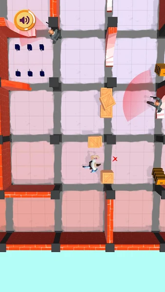
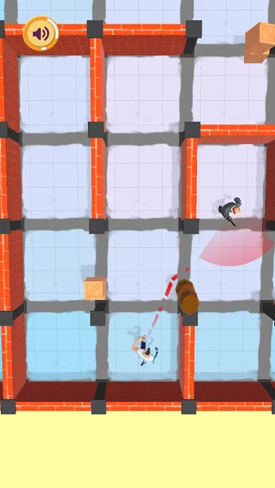
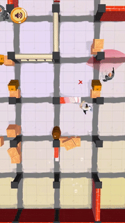
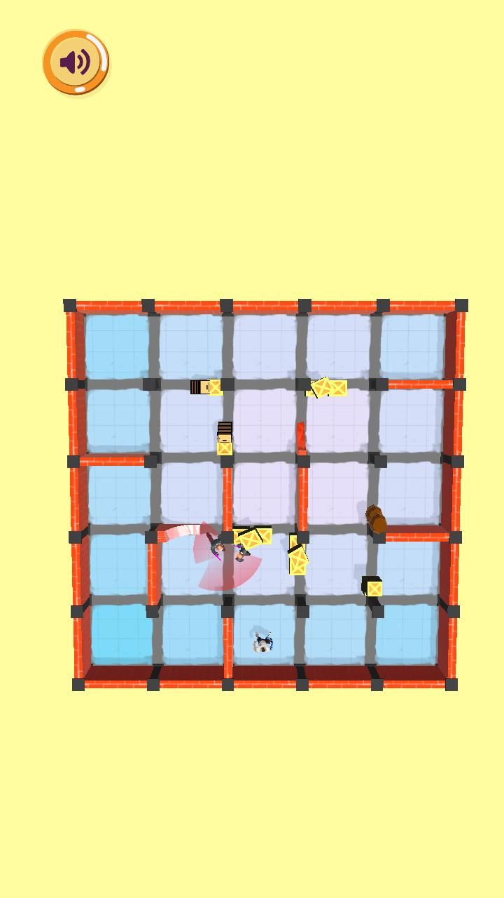
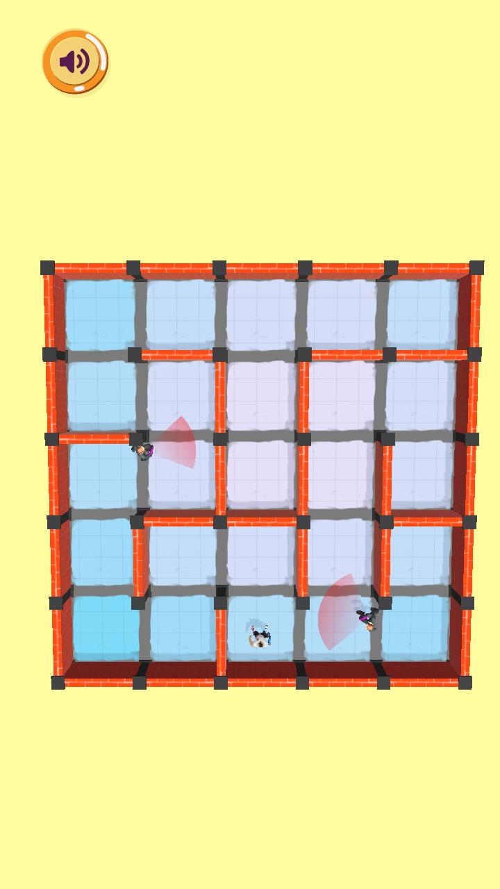
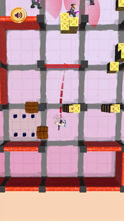
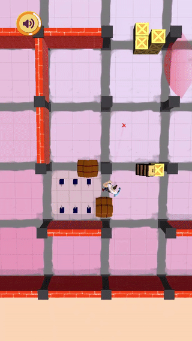

# SuperPunchMan
<body>
  
A Mobile Game built with Unity 3D Engine.
  
</body>

   
<body>
  
## Game Link 
  
  Available on Google Playstore : https://play.google.com/store/apps/details?id=com.MymCo.SuperPunchman
## Code Structure
  
  To Access  [Scripts](https://github.com/Mostafaelsherief/SuperPunchMan/tree/main/RobbersRace/Assets/Scripts)
  
  
 #### Characters 
Basically, a Guard searches for the Player, if the Player is in the guard's field of view then the Guard kills the Player and the Round is lost, if the Player kills the Guard, that happens when the Player Hits the guard from his Back then the guard dies, and the Player wins.The main characters are Player and Guards, for their Movement a Unity Built-in Pathfinding algorithm is used, each character can exist in a number of states. A change of state occurs using a state machine and is triggered by a certain event.
 
The Player exists in four states: Moving State, Dead State, Hit by Laser State and Win State. A Guard exists in Three states: Patrolling State, A Shooting state, and Dead state.Each state is characterized by a certain action and an animation,As an Example here the player is Moving, so current State is a Moving State,  and the guard is in a Patrolling state,then the Player is in the Guard’s field of View so a change of state is triggered, the guard changes to a shooting State, and the Player changes to dead state .
  

  
In [Charater Folder](https://github.com/Mostafaelsherief/SuperPunchMan/tree/main/RobbersRace/Assets/Scripts/Character) you can access **Character.cs** containing Movement and Animation functionalities shared between Guard and Player,  **State.cs** for State Class, and **StateMachine.cs** for the State Machine ,in [Player](https://github.com/Mostafaelsherief/SuperPunchMan/tree/main/RobbersRace/Assets/Scripts/Character/Player) and [Guard] folders you can access the States that correspond to each character mentioned in the section above. 
  
  
#### Ground

MazeSpawner Class generates complex non-cycled mazes using a recursive approach . Source:https://assetstore.unity.com/packages/tools/modeling/maze-generator-38689

in this Project only one Path was Available and some areas were dead ends, After changing the Wall prefab used on the original project with some crates and broken wall prefabs you get an open ground with no closed Areas.
| With Crates/Broken Walls  | Without Crates/Broken Walls |
| ------------- | ------------- |
|   |    |

### Level Generation

To Make the game progressive the ground size  and the number of guards increases , depending on the number of Levels you’ve passed , and later in the game  Laser traps and  Electric Traps are introduced,if the Player hits a laser a siren will be heard and the guards will move towards the laser position , if the Player hits an  Electric trap you die instantly.
 | Laser Trap   | Electric Trap |
| ------------- | ------------- |
|   |    |

The Mazes are generated Randomly ,so if we choose a certain random seed with the same maze width and height the same ground will be generated .
NavmeshSurface is a component  of Unity Built-in Pathfinding Algorithm it generates the Ground on which a player can Move , so before the Game starts a NavMeshSurface is generated.According to this a Level Generator Class , each Level has a predetermined Level number Random Seed number of Guards , Mazewidth , Mazeheight ,is there an Electric Trap and  is there a Laser Trap. 

  </body >

